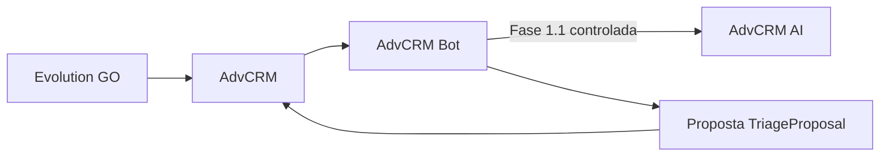

# AdvCRM Bot

Orquestrador de **classificação e triagem jurídica** do ecossistema AdvCRM.

> A IA não executa ações. Ela produz decisões estruturadas. O AdvCRM valida políticas, controla estado e decide qualquer ação externa.

Este serviço **não** substitui advogado, **não** emite parecer jurídico conclusivo e **não** determina automaticamente se o lead possui um direito.

## Relação com os demais projetos



| Projeto | Papel |
|---|---|
| **advcrm** | CRM principal; dono do banco; estado oficial; único autorizado a enviar mensagens |
| **advcrm-ai** | Runtime de inferência; structured output estrito; sem acesso ao banco do CRM |
| **advcrm-bot** (este) | Duas inferências fail-closed; valida; aplica políticas; produz **proposta** |

O bot **ainda não** envia mensagens WhatsApp e **ainda não** grava no AdvCRM. Resultados são propostas.

## Fase 1.1 — o que faz

- Cliente HTTP configurável (`AI_RUNTIME_*`) com Chat Completions + `json_schema` estrito
- Duas chamadas: `lead_understanding.v1` e `triage_next_step.v1`
- `TriageProposal` com `safe_fallback` em falha técnica (sem fabricar next step)
- CLI offline/live: `python -m app.cli.triage`
- Suíte de avaliação sintética (`evaluations/`, 41 casos)

## Fora do escopo (ainda)

Evolution GO, webhook, banco, filas, CRM write, UI, fine-tuning, RAG, áudio/documentos, auth pública definitiva, execução automática de ações.

## Instalação

```bash
make install
cp .env.example .env
```

Runtime desabilitado por padrão (`AI_RUNTIME_ENABLED=false`).

## Execução do serviço

```bash
make run
```

- `GET /ready` — config + taxonomia + playbooks + schemas/prompts. Runtime só se `AI_RUNTIME_REQUIRED=true` (exige `AI_RUNTIME_HEALTH_PATH`).

## CLI de triagem

```bash
# Offline — monta payloads, não chama runtime
python -m app.cli.triage --input examples/valid/01_prison_allowance_spouse.json --understanding-only

# Next step offline — envelope próprio
python -m app.cli.triage --input envelope.json --next-step-only

# Live — exige AI_RUNTIME_ENABLED=true e modelo
python -m app.cli.triage --input examples/valid/01_prison_allowance_spouse.json --live
```

`--understanding-only` e `--next-step-only` são mutuamente exclusivos.

## Avaliação

```bash
make eval-offline
# Live (manual, nunca no CI):
# AI_RUNTIME_ENABLED=true AI_RUNTIME_MODEL=... python -m evaluations.runner --live
```

Ver [evaluations/README.md](evaluations/README.md) e [docs/evaluation.md](docs/evaluation.md).

## Testes e qualidade

```bash
make check
docker compose build
```

## Fail-closed

Falha técnica → `TriageProposal.status=failed_closed` + `safe_fallback` (`source=deterministic_policy`, `recommended_internal_action=request_human_review`).  
**Não** inventa `TriageNextStep` e **não** seta `requires_human_handoff=true` automaticamente.  
Se só a 2ª etapa falhar, `lead_understanding` é preservado.

## Privacidade

Logs só com IDs técnicos. Sem API key no stdout. Avaliação sintética ≠ validação humana. Confiança do modelo ≠ probabilidade jurídica.

## Autoridade final

O **AdvCRM** continua sendo a autoridade final de estado, política e ação externa.
