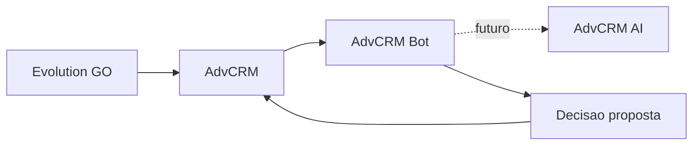

# AdvCRM Bot

Orquestrador de **classificação e triagem jurídica** do ecossistema AdvCRM.

> A IA não executa ações. Ela produz decisões estruturadas. O AdvCRM valida políticas, controla estado e decide qualquer ação externa.

Este serviço **não** substitui advogado, **não** emite parecer jurídico conclusivo e **não** determina automaticamente se o lead possui um direito.

## Relação com os demais projetos



| Projeto | Papel |
|---|---|
| **advcrm** | CRM principal; dono do banco; tenancy; autorização; estado oficial; único autorizado a enviar mensagens |
| **advcrm-ai** | Runtime de inferência (futuro); structured output estrito; sem acesso ao banco do CRM |
| **advcrm-bot** (este) | Orquestra classificação/triagem; recebe contexto já autorizado; devolve decisões estruturadas |

A aresta para `advcrm-ai` é **integração futura**. Nesta fase o bot apenas define contratos, taxonomia, políticas e validação local.

## Limites de responsabilidade (Fase 1)

**Faz:**

- Modelos de domínio e contratos Pydantic estritos (`extra=forbid`)
- Taxonomia jurídica versionada
- Máquina de estados (validação de transições)
- Playbooks iniciais e políticas determinísticas
- Exportação de JSON Schema
- API mínima de health/ready/metrics e validação de contratos

**Não faz:**

- Integração real com Evolution GO ou envio de mensagens
- Acesso ao PostgreSQL do AdvCRM
- Filas (Redis/RabbitMQ/Kafka)
- Autenticação definitiva entre serviços
- UI, treinamento, documentos/áudio reais, chamadas HTTP ao `advcrm-ai`
- Conclusões de mérito, elegibilidade ou probabilidade de êxito

## Requisitos

- Python 3.12+
- Make (opcional)

## Instalação

```bash
make install
# ou:
python3.12 -m venv .venv
.venv/bin/pip install -e ".[dev]"
```

Copie `.env.example` para `.env` se desejar ajustar limiares.

## Execução

```bash
make run
# ou:
.venv/bin/uvicorn app.main:app --host 0.0.0.0 --port 8080 --reload
```

Endpoints:

- `GET /health`
- `GET /ready` — valida configuração, taxonomia e playbooks
- `GET /metrics`
- `POST /v1/contracts/lead-understanding/validate`
- `POST /v1/contracts/triage-next-step/validate`
- `POST /v1/contracts/triage-request/validate`

Docker:

```bash
docker compose up --build
```

## Testes e qualidade

```bash
make check
# equivalente a:
make format-check lint typecheck test schemas
```

## Exportar JSON Schemas

```bash
make schemas
```

Gera de forma determinística:

- `artifacts/schemas/lead_understanding.v1.json`
- `artifacts/schemas/triage_next_step.v1.json`
- `artifacts/schemas/triage_analysis_request.v1.json`

Futuramente esses schemas serão enviados ao `advcrm-ai` em `response_format.json_schema` com `strict=true` e validação fail-closed. A chamada HTTP **não** está implementada nesta fase.

## Como adicionar área, assunto ou playbook

1. **Área/assunto:** edite `app/taxonomy/data/legal_subjects.v1.yaml` e, se necessário, o enum correspondente em `app/domain/enums.py`.
2. **Subassuntos detalhados:** nesta fase só `prison_allowance` e `vehicle_purchase_irregularities` têm catálogo fino.
3. **Playbook:** adicione YAML em `app/playbooks/data/`, valide com o modelo `Playbook`, atualize a contagem esperada se mudar o total.
4. Rode `make test` e atualize `docs/taxonomy.md` / `docs/architecture.md`.

## Documentação

- [docs/architecture.md](docs/architecture.md)
- [docs/contracts.md](docs/contracts.md)
- [docs/taxonomy.md](docs/taxonomy.md)
- [docs/state-machine.md](docs/state-machine.md)

## Privacidade

- Exemplos anonimizados; sem capturas reais sem tratamento
- Logs correlacionam por IDs técnicos; não registram texto integral de conversas
- Sem credenciais no repositório
- Sem cadeia de pensamento armazenada
- Fail-closed em contratos inválidos

## Autoridade final

O **AdvCRM** continua sendo a autoridade final de estado, política e ação externa.
# advcrm-bot
