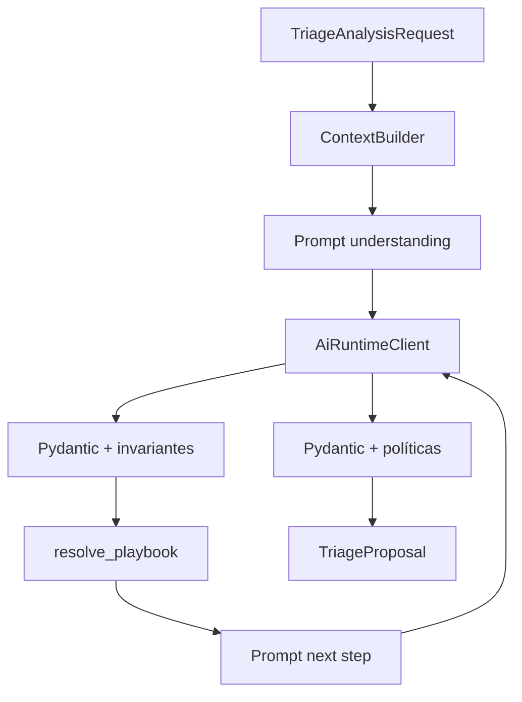

# Arquitetura — AdvCRM Bot

## Fase 1.1

- Cliente: [`app/clients/ai_runtime.py`](../app/clients/ai_runtime.py)
- Serviços: [`app/application/services.py`](../app/application/services.py)
- Proposta: [`app/schemas/proposal.py`](../app/schemas/proposal.py)
- Prompts: [`app/prompts/`](../app/prompts/)

Falha técnica → `safe_fallback` determinístico (revisão interna), sem `TriageNextStep` artificial.

## Autoridade

AdvCRM executa. Bot propõe. Sem WhatsApp/CRM write nesta fase.
