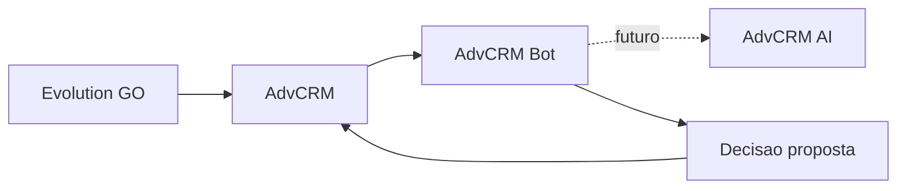

# Arquitetura — AdvCRM Bot (Fase 1)

## Papel no ecossistema

O `advcrm-bot` é um orquestrador de triagem. Ele recebe contexto **já autorizado** pelo AdvCRM, interpreta conversas com contratos estruturados e devolve **decisões propostas**. Não acessa o PostgreSQL do CRM e não envia mensagens pelo Evolution GO.

## Camadas

| Camada | Responsabilidade |
|---|---|
| `app/api` | HTTP mínimo (health, ready, metrics, validate) |
| `app/application` | Validação local; Protocols futuros (`AdvCrmAiClient`, `AdvCrmDecisionSink`) |
| `app/domain` | Enums, FSM, invariantes |
| `app/schemas` | Contratos Pydantic estritos |
| `app/taxonomy` | Catálogo YAML área → assunto → subassuntos |
| `app/playbooks` | 9 playbooks YAML (`yaml.safe_load`) |
| `app/policies` | Funções puras; limiares em Settings |
| `app/observability` | Prometheus; logs por IDs |

## Princípios

1. IA produz decisões estruturadas; AdvCRM executa.
2. Fail-closed em contratos inválidos.
3. Sem mérito jurídico conclusivo.
4. Estado oficial pertence ao AdvCRM; a FSM local só valida transições.
5. YAML sempre via `yaml.safe_load`.

## Fora de escopo (Fase 1)

Integração HTTP com `advcrm-ai`, filas, banco, auth definitiva, UI, documentos/áudio reais, envio de mensagens.
