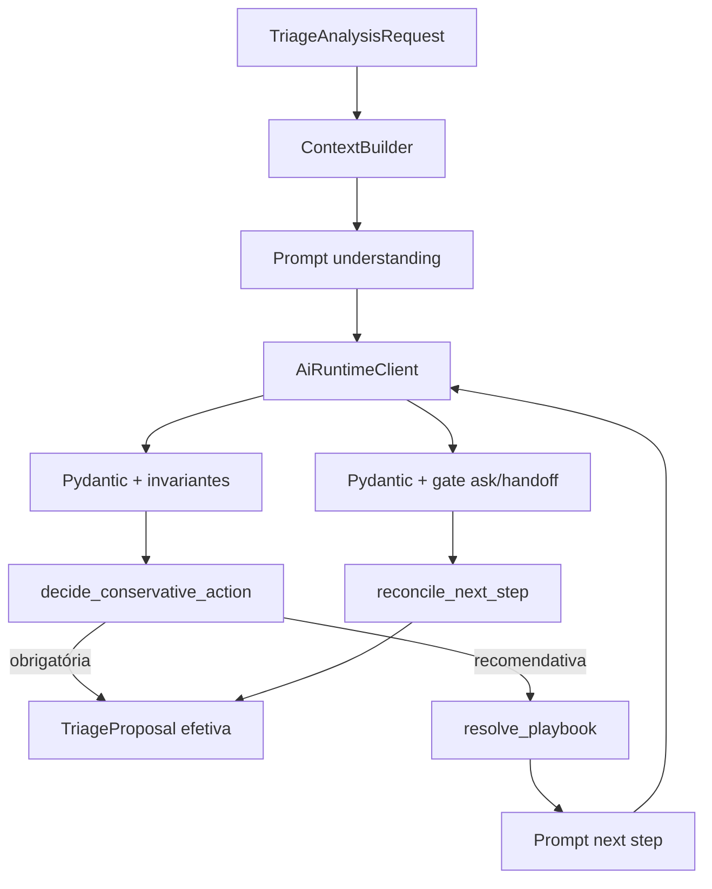

# Arquitetura — AdvCRM Bot

## Fase 1.1

- Cliente: [`app/clients/ai_runtime.py`](../app/clients/ai_runtime.py) — adaptador `POST /internal/v1/generate/structured`
- Serviços: [`app/application/services.py`](../app/application/services.py)
- Resolução de política: [`app/policies/resolution.py`](../app/policies/resolution.py)
- Proposta: [`app/schemas/proposal.py`](../app/schemas/proposal.py) — `triage_next_step` (efetiva) ≠ `model_next_step_proposal`
- Lacunas de regra (não inventar): [`docs/POLICY_GAPS.md`](POLICY_GAPS.md)

### Prompts e política ativos

| Recurso | Versão | Notas |
|---|---|---|
| Understanding prompt | `lead_understanding.v9` | Hash SHA-256 em metadata/falhas |
| Safety prompt (contrato v2) | `safety_signals.v4` | Ocorrências + cues; anti-FP; schema JSON inline |
| Safety prompt (contrato v1) | `safety_signals.v2` | Legado; sem temporalidade/cues |
| Next-step prompt | `triage_next_step.v3` | Sem alteração de precedência |
| Política | `conservative_action.v7` | Precedência inalterada; consome efetivos agregados |
| Política degradada | `degraded_safety.v2` | Exige `safety_signals.v2` tipado + extrator-only |
| Composição | `effective_safety.v3` | Normal: extrator affirmed **ou** taxonomia+fato; degradado: só extrator |
| Estado factual | `fact_state.v2` | Chave resolvida vs NÃO resolvida |
| Guard | `spam_inconsistency_guard.v1` | Pós-decisão |
| Contratos | `lead_understanding.v1`, `triage_next_step.v1`, `safety_signals.v1`+`v2` | v1 preservado |
| Proposta (interno) | `success` / `failed_closed` / `degraded_safety` | Degradado ≠ sucesso completo |

Fluxo normal: understanding → validação → candidatos → safety → `effective_safety.v3` →
política → next-step se necessário.

Fluxo degradado (somente `schema_validation` / `structured_validation` / `semantic_validation`):
safety 1×; composição extrator-only; `degraded_safety.v2`. `context_limit` e
`contract_version` **não** liberam safety. Contrato v1 no degradado → revisão interna
(sem inventar temporalidade).

Ativação: schema no body do POST (sem registro em AdvCRM AI). Artefato v2 ≈3 KiB
(&lt;16 KiB). Setting `AI_SAFETY_SIGNALS_SCHEMA_VERSION` (padrão `safety_signals.v2`).

Sinais: candidatos ≠ operacionais. Subject no catálogo sozinho não promove.
Vocabulário: [`FACT_VOCABULARY.md`](FACT_VOCABULARY.md).

`evidence_quote` literal comprova existência do trecho — não a interpretação semântica.

Não há autodetecção nem fallback silencioso para Chat Completions.

## Autoridade

AdvCRM executa. Bot propõe. Sem WhatsApp/CRM write nesta fase.
