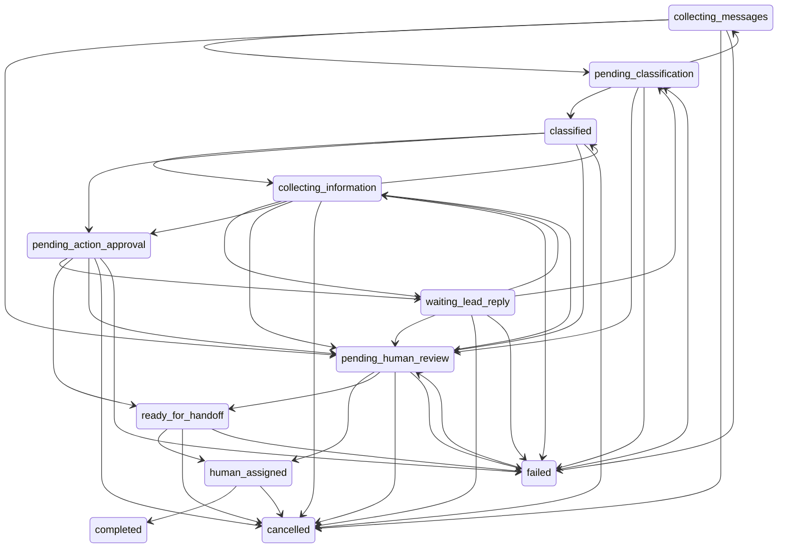

# Máquina de estados

O **estado oficial** pertence ao AdvCRM. Este módulo valida transições propostas e rejeita as inválidas sem correção silenciosa.

## Estados

- `collecting_messages`
- `pending_classification`
- `classified`
- `collecting_information`
- `waiting_lead_reply` — pergunta selecionada; aguarda resposta do lead
- `pending_action_approval` — decisão aguarda autorização do AdvCRM
- `pending_human_review`
- `ready_for_handoff`
- `human_assigned`
- `completed` (terminal)
- `cancelled` (terminal)
- `failed` — recuperação controlada apenas para `pending_classification` ou `pending_human_review`

## Regras importantes

1. Não existe `human_assigned → collecting_information` (automação não retoma silenciosamente após handoff).
2. `human_assigned` só segue para `completed` ou `cancelled`.
3. Transições inválidas levantam `InvalidTransitionError`.

